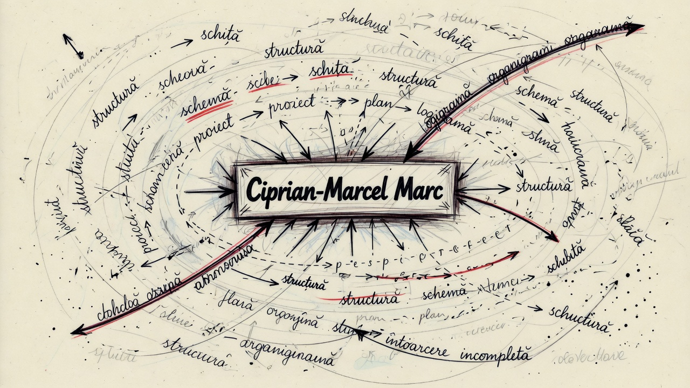

# MindSlice

[](https://github.com/ciprianmarcelmarc240277/mindslice-app/actions/workflows/ci.yml)

MindSlice este o platforma scriitoriceasca si artistica bazata pe ideea unui `Artist AI care gandeste live si poate fi contaminat de autorii care publica in jurnal`.



## Core Concept

MindSlice nu este un simplu generator AI. Este un sistem cognitiv post-generativ in care autorii influenteaza gandirea live a unui artist artificial.

Formula centrala a produsului este:

`Artist AI live + jurnal contaminant + triada sense / structure / attention`

Jurnalul nu este doar arhiva. Jurnalul este agent de contaminare.

## Triada Sistemului

- `ART ↔ SENSE`
- `DESIGN ↔ STRUCTURE`
- `BUSINESS ↔ ATTENTION`

### ART ↔ SENSE

Axa sensului: simbol, emotie, memorie, ambiguitate, tensiune poetica, imaginar.

### DESIGN ↔ STRUCTURE

Axa structurii: compozitie, organizare, tipar, fragmentare, arhitectura interna a gandirii.

### BUSINESS ↔ ATTENTION

Axa atentiei: focalizare, ritm, dominanta, persistenta, distributia tensiunii.

Autorii nu publica doar continut. Ei modifica:

- distributia sensului
- structura gandirii
- regimul atentiei

## Ce Face Aplicatia

- ruleaza un flux live de gandire artistica
- expune directii conceptuale si stari vizuale
- permite salvarea de momente in cont
- defineste identitatea publica a autorului prin nume, pseudonim si formula de adresare
- pregateste infrastructura pentru transformarea momentelor salvate in jurnal contaminant

## Identitatea Autorului

Profilul public al autorului este tratat editorial, nu administrativ.

- `display_name` este numele public si trebuie salvat in formatul `Nume, Prenume`
- `pseudonym` este optional si este afisat intre ghilimele
- `address_form` controleaza formula de adresare din interfata

Scopul nu este doar autentificarea, ci construirea unei semnaturi coerente pentru o platforma de autori, compozitori si creatori.

## Jurnalul Gandirii

Directia de produs pentru jurnal este:

1. un moment salvat devine draft editorial
2. autorul il transforma in text de jurnal
3. textul publicat devine sursa de influenta pentru Artistul AI
4. sistemul injecteaza contaminarea in gandirea live

Asta inseamna ca postarea publicata poate schimba:

- vocabularul activ
- structura interna a gandirii
- centrul de atentie al sistemului

## Genealogie Artistica

MindSlice vine dintr-o genealogie mixta, situata la intersectia dintre arta conceptuala, systems aesthetics, arta generativa, tipografie experimentala, teoria textului, teoria interfetei si studiile despre atentie. Nu apartine unei singure traditii si nici nu poate fi citit doar ca proiect tehnologic. Mai curand, el functioneaza ca un sistem cultural in care gandirea, forma, scriitura si distributia atentiei devin material artistic.

In primul rand, MindSlice se inscrie in linia artei conceptuale, unde ideea, regula si instructiunea sunt mai importante decat obiectul finit. In acest sens, genealogia lui atinge nume precum Marcel Duchamp, Sol LeWitt, Joseph Kosuth si Lawrence Weiner. De aici vine convingerea ca opera nu este doar ceea ce se vede, ci si sistemul care face posibil ceea ce se vede.

In al doilea rand, proiectul apartine traditiei in care opera este inteleasa ca sistem viu, nu ca forma statica. Aici devin esentiali Jack Burnham, Roy Ascott si Hans Haacke. Din aceasta filiatie vine ideea ca arta poate functiona prin feedback, ecologii de relatii, contaminare si transformare continua. MindSlice nu este construit ca un simplu obiect digital, ci ca o structura activa, capabila sa fie influentata si reconfigurata de interventiile autorilor.

In raport cu arta generativa, MindSlice vine clar din aceasta traditie, dar o depaseste. El mosteneste logica procesuala si algoritmica prezenta la Vera Molnar, Manfred Mohr, Frieder Nake, Casey Reas si Ben Fry, dar nu ramane la nivelul generarii formale. Proiectul muta accentul dinspre variatie vizuala spre memorie, sens, autorie distribuita si bruiaj conceptual. De aceea, el poate fi descris mai precis ca un sistem post-generativ cognitiv.

O alta linie importanta este cea a tipografiei experimentale si a designului inteles ca structura a gandirii. MindSlice trateaza textul nu ca simplu continut, ci ca material spatial, ca particula cognitiva, ca arhitectura vizibila a sensului. In aceasta directie, genealogia lui poate fi pusa in dialog cu Jan Tschichold, Josef Muller-Brockmann, Wolfgang Weingart, April Greiman si Katherine McCoy. Nu pentru ca le reproduce stilul, ci pentru ca impartaseste ideea ca tipografia poate organiza, destabiliza si intensifica gandirea.

Proiectul se apropie si de traditia postmoderna si de teoriile deconstructiei, in care sensul nu este stabil, vocea nu este unica, iar structura poate fi fragmentata si recompusa. Aici devin relevante nume precum Jacques Derrida, Roland Barthes si Michel Foucault. Din aceasta filiatie vine interesul pentru pluralitatea sensului, pentru slabirea autorului unic si pentru text ca camp de tensiuni si redistribuiri.

MindSlice apartine, in acelasi timp, si unei genealogii a interfetei si a mediului ca forma culturala. Nu este doar o lucrare, ci o interfata care produce sens. In aceasta zona, proiectul poate fi gandit in raport cu Marshall McLuhan, Vilem Flusser, Friedrich Kittler si Lev Manovich. De aici vine intelegerea mediului nu ca suport neutru, ci ca agent activ in producerea experientei si a gandirii.

O filiatie importanta este si cea a constelatiei, memoriei si atlasului. MindSlice functioneaza prin fragmente, relatii, reaparitii si structuri de asociere, ceea ce il apropie de Aby Warburg, Walter Benjamin si Michel de Certeau. In aceasta logica, sistemul nu produce doar iesiri, ci si constelatii de sens, urme si reconfigurari ale memoriei.

In sfarsit, proiectul este profund contemporan prin axa sa `BUSINESS ↔ ATTENTION`. Aici el intra intr-o alta genealogie, in care atentia devine nu doar resursa economica, ci si regim estetic, mediu cultural si camp de lupta simbolica. In aceasta directie, pot fi invocati Jonathan Crary, Bernard Stiegler si Yves Citton. MindSlice trateaza atentia ca infrastructura artistica: nu doar ceea ce vezi conteaza, ci si ceea ce persista, ceea ce revine, ceea ce capteaza si redistribuie focalizarea.

Din perspectiva unor practici contemporane apropiate ca logica, proiectul poate fi pus in dialog cu Hito Steyerl, James Bridle, Trevor Paglen, Refik Anadol sau Forensic Architecture. Nu pentru ca ar face acelasi lucru, ci pentru ca impartaseste interesul pentru sisteme, vizibilitate, informatie, infrastructuri ale perceptiei si forme culturale emergente.

In acest sens, MindSlice poate fi inteles ca punctul de intalnire dintre: arta conceptuala, systems aesthetics, logica post-generativa, tipografie experimentala, teoria textului si a deconstructiei, teoria interfetei si a mediilor, gandirea atlasului si a memoriei, precum si studiile contemporane despre atentie.

Prin aceasta genealogie, MindSlice nu apare ca un simplu proiect "despre AI", ci ca o opera-sistem: un Artist AI care gandeste live, poate fi contaminat de autorii care publica in jurnal si transforma scriitura, structura si atentia in material artistic activ.

### Arbore Sintetic

```text
Duchamp / LeWitt / Kosuth
        │
        ├── ideea > obiectul
        │
Burnham / Ascott / Haacke
        │
        ├── sistem > lucrare fixă
        │
Molnár / Reas / Fry
        │
        ├── proces generativ > compoziție statică
        │
Weingart / McCoy / Greiman
        │
        ├── tipografie > ornament
        │
Derrida / Barthes / Foucault
        │
        ├── sens instabil / autor distribuit
        │
Warburg / Benjamin
        │
        ├── atlas / fragment / memorie activă
        │
Crary / Stiegler
        │
        ├── atenția ca mediu
        │
      MINDSLICE
```

### Arbore Extins

```text
MINDSLICE
Artist AI care gândește live și poate fi contaminat de autorii care publică în jurnal
│
├── 1. ARTA CA IDEE / SISTEM
│   ├── Marcel Duchamp
│   ├── Sol LeWitt
│   ├── Joseph Kosuth
│   └── Lawrence Weiner
│
├── 2. OPERA CA SISTEM VIU
│   ├── Jack Burnham
│   ├── Roy Ascott
│   └── Hans Haacke
│
├── 3. GENERATIV -> POST-GENERATIV
│   ├── Vera Molnár
│   ├── Manfred Mohr
│   ├── Frieder Nake
│   ├── Casey Reas
│   └── Ben Fry
│
├── 4. TIPOGRAFIE CA STRUCTURĂ A GÂNDIRII
│   ├── Jan Tschichold
│   ├── Josef Müller-Brockmann
│   ├── Wolfgang Weingart
│   ├── April Greiman
│   └── Katherine McCoy
│
├── 5. FRAGMENT / TEXT / DECONSTRUCȚIE
│   ├── Jacques Derrida
│   ├── Roland Barthes
│   └── Michel Foucault
│
├── 6. INTERFAȚĂ / MEDIA / TEHNOLOGIE
│   ├── Marshall McLuhan
│   ├── Vilém Flusser
│   ├── Friedrich Kittler
│   └── Lev Manovich
│
├── 7. CONSTELAȚIE / MEMORIE / ATLAS
│   ├── Aby Warburg
│   ├── Walter Benjamin
│   └── Michel de Certeau
│
├── 8. ATENȚIE CA REGIM ESTETIC
│   ├── Jonathan Crary
│   ├── Bernard Stiegler
│   └── Yves Citton
│
└── 9. CONTEMPORANII APROPIAȚI CA LOGICĂ
    ├── Hito Steyerl
    ├── James Bridle
    ├── Trevor Paglen
    ├── Refik Anadol
    └── Forensic Architecture
```

### Formula

```text
Conceptual Art
+ Systems Aesthetics
+ Post-Generative Logic
+ Experimental Typography
+ Deconstruction / Text Theory
+ Media Theory
+ Atlas / Memory Thinking
+ Attention Theory
= MINDSLICE
```

## Roadmap MVP

1. `saved_moments` ca memorie de lucru
2. `blog_posts` ca drafturi si publicari
3. transformarea unui moment salvat in draft de jurnal
4. scoruri de influenta pentru `sense`, `structure`, `attention`
5. contaminarea Artistului AI live pe baza postarilor publicate
6. UI care arata clar sursa bruiajului

## Stack

- Next.js 16
- React 19
- TypeScript
- Clerk
- Supabase
- GitHub Actions
- Vercel

## Rulare Locala

1. Instaleaza dependintele:

```bash
npm ci
```

2. Creeaza `.env.local`:

```bash
cp .env.example .env.local
```

3. Completeaza variabilele:

```env
NEXT_PUBLIC_CLERK_PUBLISHABLE_KEY=
CLERK_SECRET_KEY=
NEXT_PUBLIC_SUPABASE_URL=
NEXT_PUBLIC_SUPABASE_ANON_KEY=
SUPABASE_SERVICE_ROLE_KEY=
```

4. Porneste aplicatia:

```bash
npm run dev
```

Aplicatia ruleaza la `http://localhost:3000`.

## Supabase

- schema: [`supabase/schema.sql`](./supabase/schema.sql)
- setup rapid: [`SUPABASE_SETUP.md`](./SUPABASE_SETUP.md)

## Specificatie Tehnica

Documentul tehnic pentru MVP este in [`TECH_SPEC.md`](./TECH_SPEC.md).

## Manifest Scurt

MindSlice este un sistem in care gandirea nu este fixa.
Ea poate fi tulburata, contaminata si reordonata.
Autorii nu publica doar texte.
Ei schimba sensul, structura si atentia unui Artist AI care gandeste live.
